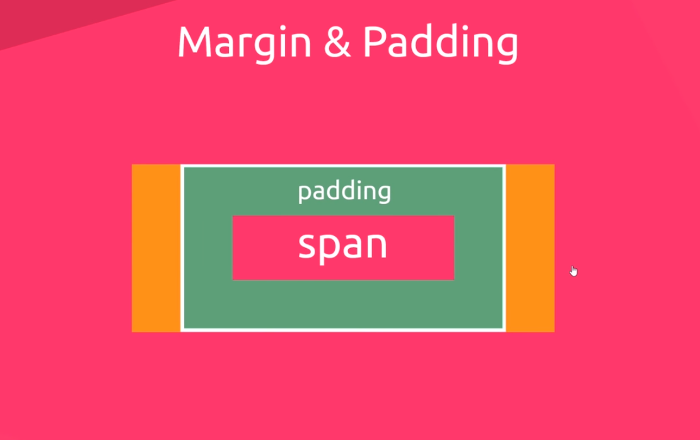
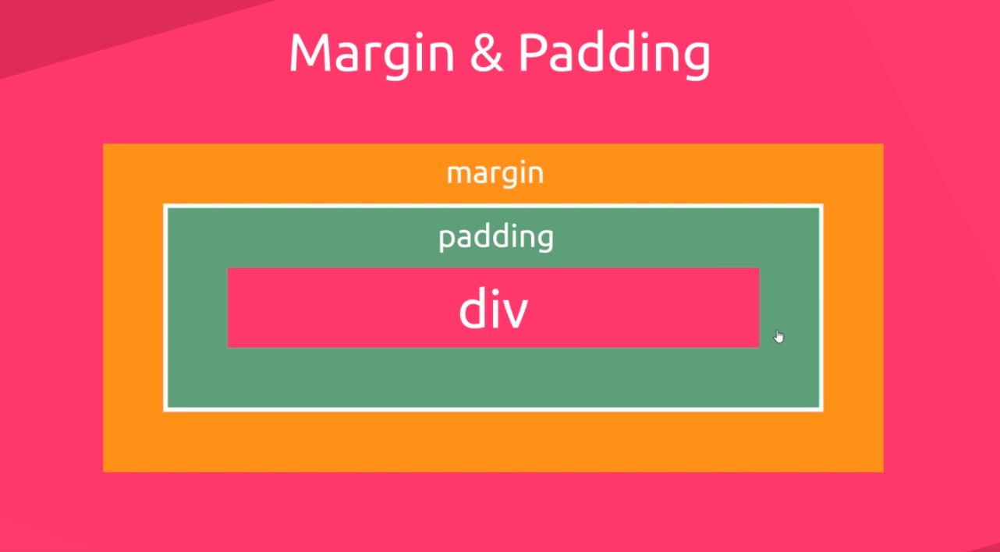

# Simple-Tag HTML
The __most commonly__ used HTML tags are as follow :
- [p tag ](https://www.w3schools.com/tags/tag_p.asp)  - The p tag  **defines a paragraph** 
- [strong tag ](https://www.w3schools.com/tags/tag_strong.asp) - Defines **important** text 
- [em tag ](https://www.w3schools.com/tags/tag_em.asp) - **Emphasized** text 
- [small tag ](https://www.w3schools.com/tags/tag_small.asp) - Defines **small** text 
- [h1 tag ](https://www.w3schools.com/tags/tag_hn.asp) - For the **site title** 
- [h2 tag ](https://www.w3schools.com/tags/tag_hn.asp) - For the **webpage** 
- [h3 tag ](https://www.w3schools.com/tags/tag_hn.asp) - For a **article heading**
- [h4 tag ](https://www.w3schools.com/tags/tag_hn.asp) - For a **sub navigation** inside the article 

## CSS (Style Sheets)
- CSS stands for **C**ascading **S**tyle **S**heets
- style sheet - a list of CSS rules/rule sets
- CSS describes **how HTML elements are to be displayed on screen, paper, or in other media**

### CSS Columns property
```
column-gap : Space of column gap
column-count : number of columns  
```

## Note
 - what a element? <br>
    A simple example is the **text box**, which allows you to enter some textual data on a webpage. Most commonly used web elements are :
    1. Text box
    1. Button
    1. Dropdown list
    1. Hyperlink
    1. Check Box
    1. Radio Button.

 - Inline Elements - Mostly of **letters**, **pictures** for instance *span, a, br, input, button, em, strong, textarea*
    - Don't take up and more room than their content need 
    - Inline Elements using **text-align** - Center used with **tag p** or **tag h** is a central way for content within that element, not the element itself
    - ลักษณะการทำงานของ span มีความคล้ายคลึงกับการทำงาน ของ div ในเชิงแนวความคิด คือการนำเอามาจัดวางโครงสร้างเพื่อให้ใช้ css แสดงจัดการแสดงผลกับข้อมูล span tag จะถูกเรียกใช้งานก็ต่อเมื่อคุณต้องการจะเสกข้อมูลที่มีอยู่ในบรรทัดนั้นๆ ให้แสดงผลในรูปแบบและลักษณะแตกต่างออกไป (แค่รูปแบบการแสดงผลนะครับ ไม่เกี่ยวกับการเน้นย้ำเรื่องความหมาย) เช่น สีที่แตกต่าง หรือ ขีดเส้นใต้ มีขอบสี มีพื้นหลังไฮไลท์
    - ทำสามารถ เเปลง inline Element เป็น block Element ได้ หรือเเปลงกลับไปกลับมาได้ด้วย โดยการใช้ **display:block;** เปลี่ยน inline Element เป็น Block

- Block level Element Most of them are __tags__ that **automatically line up** for instant *div, p, h1, header, footer, nav, ul, ol, li, table, video*
    - Take up the whole width of a page regardless of content
    - Block-level Element ใช้ margin - auto (ต้องกำหนด width ให้กับ element ที่จะจัดให้อยู่กลางหน้าด้วย!) มักใช้กับ div และ Block-level Element อื่นๆ เป็นการจัดกลางหน้าให้ตัว element เอง ไม่เกี่ยวข้องกับ content ด้านใน Element นั้นๆ
    - มันจะจองพื้นที่ส่วนหนึ่งเอาไว้เป็น Block เเนวนอนทั้งหมด

## Margin & Padding
- Inline Elements - only margin left and right


- Block level Element - padding and margin all the way around


